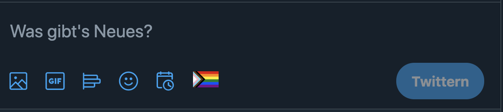
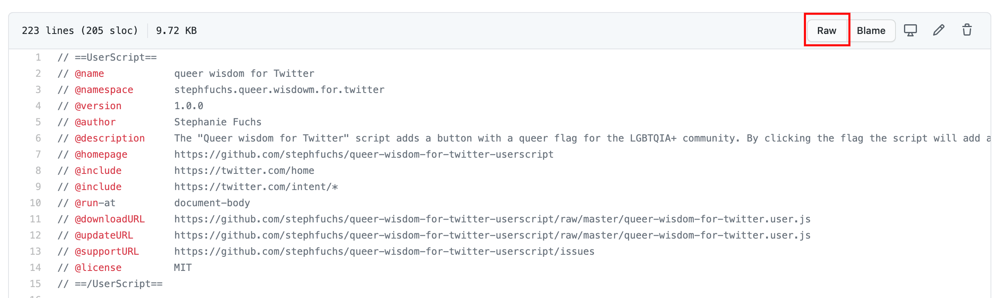
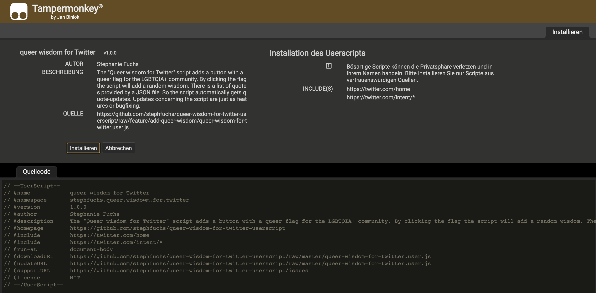

# "Queer wisdom for Twitter"

User script for Tampermonkey & Greasemonkey

It is recommended to use the latest browser, addon and plugin
versions.

## Introduction

The "**Queer wisdom for Twitter**" script adds a button with a queer flag for the LGBTQIA+ community. By clicking the
flag the script the page will reload and display the modal with a random queer wisdom.

If you want to add another quote, just click the flag again, it will randomly generate a new tweet. In some cases you
will receive the same tweet. that is the fun with random, right?

## Tampermonkey & Greasemonkey

This user script needs an addon for (**latest**) Google Chrome or (**latest**) Firefox web browser. Please always use
the latest addon version.

### Installing the addon to your webbrowser

- Google Chrome: [Tampermonkey](https://www.tampermonkey.net/)
- Firefox: [Greasemonkey](https://www.greasespot.net/)

### add user script

If the addon is installed, just click on
[raw](https://github.com/stephfuchs/queer-wisdom-for-twitter-userscript/raw/master/queer-wisdom-for-twitter.user.js)
and the extension opens an interface to install the script. Just click "install" to make sure you get the queer stuff.

Click on "raw":

Install the user script to e.g. Tampermonkey

## See also

- [Changelog](https://github.com/stephfuchs/queer-wisdom-for-twitter-userscript/blob/master/CHANGELOG.md)
- [License](https://github.com/stephfuchs/queer-wisdom-for-twitter-userscript/blob/master/LICENSE)
- [Releases](https://github.com/stephfuchs/queer-wisdom-for-twitter-userscript/releases)
